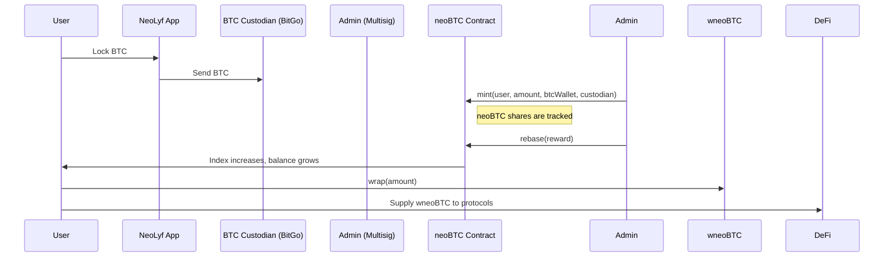

# neoBTC & wneoBTC

**neoBTC** is an index-based rebasing token that represents real BTC held by trusted custodians like BitGo, allowing users to earn yield while maintaining exposure to Bitcoin.  
**wneoBTC** is a wrapped, non-rebasing version of neoBTC designed for seamless use in DeFi protocols like lending, borrowing, and trading.

## Overview

NeoLyf’s BTC staking system enables users to benefit from Bitcoin yield without actively managing their BTC. It combines off-chain yield generation with on-chain utility, unlocking new DeFi opportunities for BTC holders in a simple and transparent way.

## Contracts

| Contract     | Description                                           |
|--------------|-------------------------------------------------------|
| `neoBTC.sol` | Rebasing token reflecting BTC staked off-chain       |
| `wneoBTC.sol`| Non-rebasing wrapper used for DeFi compatibility     |

## How It Works

### Flow Summary

1. Users lock BTC through the NeoLyf mobile app.
2. BTC is sent off-chain to a trusted custodian like BitGo.
3. The NeoLyf admin (multisig) mints `neoBTC` to reflect the user’s position.
4. Yield earned by the custodian is added through a rebase, increasing the index.
5. User balances grow automatically as the index increases.
6. Users can wrap their `neoBTC` into `wneoBTC` for DeFi usage.
7. When users wish to redeem BTC, the admin burns `neoBTC`, and the user is paid in BTC through the NeoLyf app.

### Why CoreDAO?
neoBTC is deployed on CoreDAO, the fastest-growing Bitcoin-secured EVM chain.
CoreDAO combines the security and decentralization of Bitcoin with the programmability of Ethereum, making it an ideal home for BTC-based applications like neoBTC.

With native BTC bridging, low gas fees, and a growing DeFi ecosystem, CoreDAO offers the perfect foundation for a yield-bearing BTC product that can integrate with lending markets, staking platforms, and cross-chain swaps.

neoBTC leverages CoreDAO's infrastructure to make Bitcoin productive — without compromising user experience or security.

### Design Details
- neoBTC
- Rebasing via a global index.
- No ERC4626: BTC is not held on CoreDAO chain.
- Only admin/multisig can mint/burn.
- Emits BTC wallet and custodian data for auditability.
- No transfers allowed — must use wneoBTC to interact with DeFi.

### wneoBTC
- ERC20-compliant wrapper for DeFi protocols.
- Fixed-balance token with wrapping and unwrapping based on the current index.
- Allows users to supply collateral, trade, or provide liquidity using BTC yield representation.